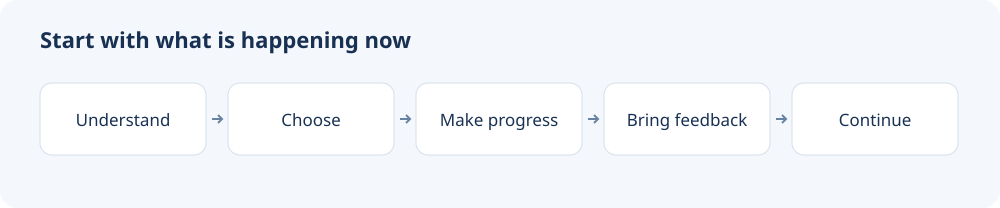

# ZANE Life Workbench

[简体中文](README.md) | English

> Turn your current situation into choices you can stand behind and actions you can follow through on.

[](VERSION.md)
[](LICENSE)

One command installs a collection of Agent Skills that work together to help you understand your situation, weigh choices, coordinate time and responsibilities, complete useful work, and adjust as life changes.

**For Claude Code, Codex, and other tools that support Agent Skills. Free and open source.**

[Quick start](#quick-start) · [What it helps with](#what-it-helps-with) · [Capabilities](#capabilities) · [Install](#install) · [Using the workbench](#using-the-workbench)



## What it helps with

Start with something happening in your life, and connect your thinking to what comes next.

| What you want to work on | What the workbench helps you reach |
| --- | --- |
| Compare jobs, cities, study plans, or ways of living | A clear view of the conditions and tradeoffs behind each option |
| Coordinate work, family, and personal plans | An arrangement that accounts for time, energy, money, and existing commitments |
| Explore your motives, values, or recurring choices | Insights grounded in experience, with things to try in daily life |
| Follow through on a decision | Useful materials, concrete actions, and revisions based on real responses |
| Continue something over several sessions | Saved work and decisions that let you pick up where you left off |

## Quick start

### 1. Install

```bash
npx -y skills add xuehuafu233-alt/zane-life-workbench -g --all
```

### 2. Tell your Agent what you are working through

```text
Use zane-workbench.
I am comparing two jobs: one pays more but has a longer commute;
the other offers more flexibility. I care about financial stability
and time with my family. Here are the offers and my monthly expenses.
Help me compare workable arrangements and the tradeoffs of each.
```

You can also start with a smaller task:

```text
Use zane-workbench to put this week's work and family commitments into a workable schedule.

Use zane-workbench to turn these notes into the next steps for my move.

Use zane-self-insight to explore what mattered most to me in the experiences I just described.
```

## How it works

The Agent selects methods for the task at hand: understanding the situation, comparing options, producing useful work, and helping you follow through. New information or real responses prompt revisions to the affected decisions and plans.

For a job choice, that might mean comparing income and commuting time, then fitting both options around family commitments. If one offer adds remote work, the Agent revisits the balance. Save the comparison and next step when you want to continue later.

## Capabilities

| Goal | Main Skill | Typical output |
| --- | --- | --- |
| Understand a situation, choose, plan, and act | `zane-workbench` | Option comparisons, useful work, time and resource plans |
| Untangle a question with several competing intentions | `zane-question-intent-translator` | A clear decision and a question you can act on |
| Explore values, motives, and recurring choices | `zane-self-insight` | Experience-based insights and practical experiments |
| Define how a long-term AI partner works with you | `zane-agent-identity-card-builder` | Collaboration preferences, reasoning approach, and memory arrangements |
| Save work, organize sources, and resume later | `zane-workbench-curator` | Workspace navigation, task records, and continuation notes |

Use `zane-workbench` for everyday tasks, or call a specific Skill when its purpose fits. The [Skill inventory](docs/skill-inventory.md) includes more detail in Chinese.

## Install

### Recommended: install the complete collection

```bash
npx -y skills add xuehuafu233-alt/zane-life-workbench -g --all
```

Or ask your Agent:

```text
Install all Skills from https://github.com/xuehuafu233-alt/zane-life-workbench.
Then use zane-workbench to help me with this: ...
```

Reload Skills if your tool requires it. To install for the current project, omit `-g`. For updates, ask your Agent to compare the installed version with this repository and update it. Save any local edits you want to keep before replacing files.

## Using the workbench

Share the current question, relevant material, and what you want to accomplish next. Your goals, tradeoffs, and collaboration preferences take shape through use.

- **For a choice**, compare the conditions, options, and costs that matter to you.
- **For a deliverable**, ask directly for the document, analysis, or plan you need.
- **When conditions change**, bring back the new facts or responses and revise the affected work.
- **To continue later**, ask the Agent to save your progress and give it that location next time.

Keep the workspace in a folder you choose. In a regular chat, save a continuation note and paste it into the next session with the relevant material.

[Step-by-step guide](docs/guide.en.md)

## Provenance and license

The collection grew from question clarification, AI partner design, and self-reflection into a workflow for choices, action, feedback, and continuity.

See [Provenance](docs/provenance.md) for design references. This repository is released under the [MIT License](LICENSE).

Author: Zane
