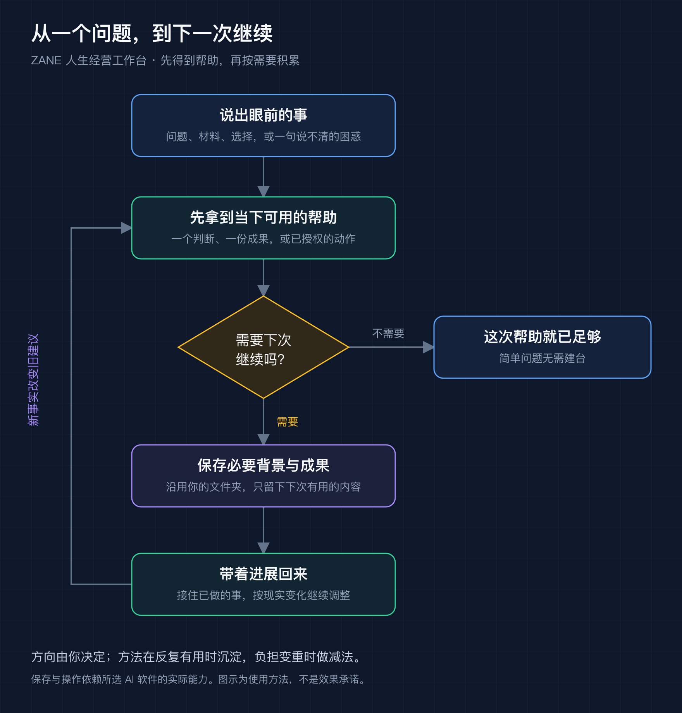
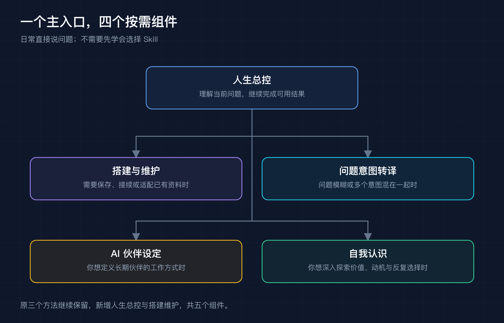

# ZANE 人生经营工作台

**从一个真实问题开始，让 AI 帮你做判断、完成事情，并在下一次接住你的进展。**

人生经营不是把生活都变成任务。工作、学习、关系、休息，以及你想保有和改变的东西，都可以成为起点。你决定方向，工作台帮助看清条件、产出成果，并随着真实反馈调整。

**0.4.1 beta · 5 个 Skill · 免费开源 · MIT**

[快速开始](#快速开始) · [安装](docs/install.md) · [完整使用手册](docs/guide.md) · [五个组件](docs/skill-inventory.md) · [示例](docs/examples.md) · [更新记录](CHANGELOG.md) · [English](README.en.md)



## 它能帮你做什么

| 你眼前的事 | 可以一起完成的结果 |
|---|---|
| 事情很多，不知道先做哪件 | 分清当前责任、时间限制与想保有的生活，确定眼前安排 |
| 想学习，但计划总是落不了地 | 给出适合当下条件的学习起点，需要时直接提供练习材料 |
| 想认识新朋友，又不喜欢热闹聚会 | 看清期待与偏好，选一个愿意尝试的场景 |
| 在两个选择之间反复纠结 | 比较承重事实、代价与不确定处，形成可以重审的决定 |
| 上次聊过的事有了变化 | 读取已保存背景，更新受影响的旧建议和下一步 |
| 希望 AI 越来越懂自己的做事方式 | 从真实经历提炼必要偏好与方法，允许你随时纠正 |

一次简单帮助可以到此结束。值得继续的事情，再保存；反复用得上的方法，再沉淀。第一次使用不必先整理人生档案，也不必学会五个组件的名字。

## 快速开始

安装后，把下面这句话发给 AI，再接着说你的事：

```text
请使用人生经营工作台，先帮我处理眼前这个问题。
需要保存或补充背景时，引导我一步步完成。

我最近事情很多，工作之外还想学英语和运动，
但每天晚上只有半小时，不知道先怎么安排。
```

它应先给你当下可用的帮助。需要持续推进时，你选一个方便保存的位置，AI 再协助保留必要背景和成果。

下次回来可以说：

```text
继续上次的事情，工作台在这个文件夹：……
最近下班更晚了，原来每天半小时的安排要改一下。
```

如果你已经知道要单独用哪个能力，也可以直接说“用问题意图转译帮我把这个问题问清楚”或“用自我认识看看我反复纠结的是什么”。

## 下载与安装

**推荐：直接让你的 Agent 从 GitHub 安装。**

在支持 Skills 的 Agent 中输入：

```text
请从 https://github.com/xuehuafu233-alt/zane-life-workbench 安装 ZANE 人生经营工作台，安装全部五个 Skill。安装完成后告诉我怎样开始第一个问题。
```

如果宿主使用 `skills` 命令，也可以执行：

```bash
npx -y skills add xuehuafu233-alt/zane-life-workbench -g --all
```

安装后，直接输入：

```text
使用 ZANE 人生经营工作台，先帮我处理眼前这个问题：……
```

只想先体验，也可读[纯聊天起步](docs/chat-start.md)。

模型、AI 软件及其订阅由你自行选择；这个仓库提供方法、模板、教程与本地工具。保存文件、操作外部软件、提醒等能力，取决于实际宿主。[安装方法与兼容情况 →](docs/install.md)

## 五个组件如何配合



可编辑图源：[使用流程 SVG](docs/images/life-flow.svg) · [组件关系 SVG](docs/images/skill-map.svg)

| 组件 | 什么时候用 |
|---|---|
| [人生总控](skills/zane-workbench/SKILL.md) | 日常主入口：接住问题并继续解决 |
| [搭建与维护](skills/zane-workbench-curator/SKILL.md) | 保存、接续、适配已有资料与目录 |
| [问题意图转译](skills/zane-question-intent-translator/SKILL.md) | 问题模糊、多个意图混在一起时 |
| [AI 伙伴设定](skills/zane-agent-identity-card-builder/SKILL.md) | 你希望定义一个长期 AI 伙伴时 |
| [自我认识](skills/zane-self-insight/SKILL.md) | 你想深入理解价值、动机与反复选择时 |

原来的三个对话 Skill 继续保留，新增人生总控与搭建维护，组成可独立使用的工作台。安装全部五个 Skill 后从人生总控开始；商业和职场专业扩展可另行共装。

## 从使用到积累

工作台保存的是你自己的必要背景、当前决定和真实反馈。新事实出现时，应修改依赖旧前提的建议；曾经有用的判断也可以放下。它不应该把猜测固化成人格，或把作者的目标当成你的方向。

个人材料放在你选择的工作台目录，与安装包分开。本包没有独立遥测或上传服务；提供给 AI 的材料如何处理，仍受你所选模型与宿主的数据政策影响。提交公开反馈时请只放脱敏的最小示例。

## 验证与反馈

已有 macOS 本地安装、升级、回滚及文件一致性检查，以及 AI 合成场景中的首次帮助、保存、接续和纠错验证。尚未完成陌生真人连续使用验证，也未实测全部宿主与 Windows；不把技术检查当作生活效果证明。[详细验证范围 →](docs/validation.md)

遇到问题可以[提交 Issue](https://github.com/xuehuafu233-alt/zane-life-workbench/issues/new)：写清使用的软件、想完成的事情、实际发生了什么和你希望怎样改。欢迎分享脱敏的使用反馈，也欢迎改进教程与方法。[贡献说明 →](CONTRIBUTING.md)

## 来源与许可

作者：[Zane](https://github.com/xuehuafu233-alt)。本仓库延续原 `zane-dialogue-skills` 地址，方便旧链接继续使用。

发布说明的组织方式参考 [dontbesilent2025/dbskill](https://github.com/dontbesilent2025/dbskill)：用途、示例、图示、手册与更新入口；本仓库说明和图片重新创作。方法来源与取舍见[来源说明](docs/provenance.md)。

本项目采用 [MIT License](LICENSE)，可学习、修改、分发和商用，请保留许可与版权声明。模型服务、外部项目及它们的内容遵循各自条款。
